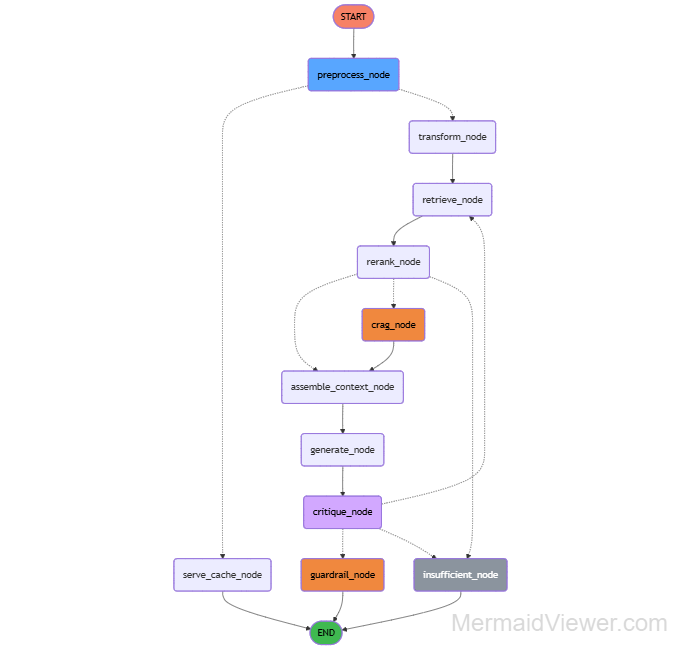

<div align="center">

<!-- HERO HEADER -->


</div>

**Multilingual, Zero-Translation Retrieval Architecture for High-Compliance Domains**

An agentic retrieval-augmented generation system engineered for India's linguistic reality, processing legal, GST, and insurance documents natively across 22 languages without intermediate translation layers.

---

> **🚨 Reality Check: The Silent Failure of English-First RAG**

>Naive RAG systems often fail in Indian production. Adding translation on top of an English pipeline leads to loss of meaning—especially in GST rules, legal details, and exact numbers. A system that gives 90% accuracy in English but only 65% in Hindi isn’t truly multilingual. Cross-language accuracy and proper handling of Hindi text must be built in, and deployment should stop if translation accuracy drops below 0.97.

<br>

<div align="center">
  <a href="https://smartdocs-website.vercel.app/">
    
  </a>
</div>

<br>

## 🎯 What This System Solves

Standard RAG architectures break down on real-world Indian data. This system explicitly engineers solutions for:

* **Translation-Induced Semantic Loss:** Eliminates the intermediate `Query -> English -> LLM -> Target Language` translation step.
* **Devanagari Processing Noise:** Mitigates Zero-Width Joiner (ZWJ) artifacts, 16 Unicode space variants, and OCR extraction anomalies prior to embedding.
* **Retrieval Failure on Alphanumerics:** Solves the dense embedding blindspot for exact-match terms (e.g., GSTINs, section codes, specific tax amounts) using optimized Reciprocal Rank Fusion (RRF).
* **Language Detection Instability:** Replaces statistically unstable detection models (which misclassify "transformer kya hai" as Norwegian) with a deterministic 7-step script-and-lexicon execution tree.

---

## 🧠 System Overview (Mental Model)

The pipeline is non-linear and stateful.

1. **Ingestion:** PDF parsing → 5-Step Indic Preprocessing → Script-Aware Parent/Child Chunking → Dense/Sparse Embedding → Row-Level Security (RLS) PostgreSQL persistence.
2. **Query Processing:** Deterministic Language Detection → Async Multi-Query Expansion (Synonym, HyDE, Step-Back).
3. **Hybrid Retrieval:** Dense (`multilingual-e5-large`) + Sparse (`BM25Okapi`) fused via RRF (k=60) → FlashRank Reranking.
4. **Agentic Reasoning:** 11-node state machine executing context assembly, LLM generation, and self-critique.
5. **Validation & Guardrails:** Post-generation evaluation of faithfulness and language match. Triggers cyclic retries (max 2) before cascading to terminal guardrails (PII redaction, injection detection).

---

## 🏗️ System Architecture

<p align="center">

</p>

### Core Components

* **Foundation Embedding:** `multilingual-e5-large` (1024-dim). Maps 100+ languages into a shared latent space. Passing a strict >0.85 cross-language cosine similarity threshold is the deployment gate.
* **Sparse Indexing:** `BM25Okapi` trained on Indic-normalized text to catch critical alphanumeric exact matches.
* **Reranker:** `FlashRank` (`ms-marco-MiniLM-L-12-v2`) executing on CPU to score top-20 hybrid candidates down to top-5.
* **Generator:** `Sarvam-30B` via streaming endpoint.
* **Orchestration:** `LangGraph` state machine to manage conditional logic, cyclic self-reflection, and API fallbacks.
* **Vector Store:** `pgvector` layered with strictly enforced async transaction-bound Row-Level Security.

---

## 🔄 LangGraph Flow Architecture

<p align="center">

</p>

### Execution & State Management

The system operates as an 11-node directed graph with 3 critical conditional routing edges:

* **Edge 1 (Preprocess):** Evaluates `aioredis` semantic cache (0.95 cosine threshold). Short-circuits the entire graph on cache hit.
* **Edge 2 (Rerank):** Evaluates system confidence. Score > 0.7 triggers standard context assembly. Score 0.3–0.7 triggers **CRAG** (Corrective RAG via Tavily web search). Score < 0.3 triggers early exit (insufficient information).
* **Edge 3 (Critique):** Validates generated output. If `faithfulness_score < 0.75` or `detected_lang != user_lang`, the graph cycles back to retrieval using a refined query. Capped at 2 retries to prevent infinite loops.

---

## 📐 Key Design Decisions

> **📝 Zero Translation Layer**
>
> * **Decision:** Query and retrieve natively in the source language using `multilingual-e5-large`.
> * **Reason:** Legal and financial terminology (e.g., "Input Tax Credit") degrades when translated to English and back.
> * **Trade-off:** Requires a much heavier embedding model and strictly mandated `passage:` and `query:` prefixing, increasing vector dimensionality and compute cost.

> **📝 Script-Aware Parent-Child Chunking**
>
> * **Decision:** Devanagari chunks at 400 tokens; Latin chunks at 500 tokens. Child chunks (256t) for retrieval, Parent chunks (1024t) for LLM context.
> * **Reason:** Devanagari is structurally more information-dense. 500 Devanagari tokens overflow standard context windows and dilute vector focus.
> * **Trade-off:** Introduces script-detection overhead during the ingestion pipeline.

> **📝 Deterministic Language Detection**
>
> * **Decision:** 7-step deterministic logic tree overriding probabilistic detection.
> * **Reason:** Standard NLP libraries fail chaotically on Hinglish and short code-mixed queries. The system forces a 130-word Hinglish lexicon match and an 85% ASCII dominance threshold before trusting probabilistic models.
> * **Trade-off:** Requires manual maintenance of the fallback lexicons.

> **📝 Agentic Workflow over Static Pipeline**
>
> * **Decision:** Implementing a stateful graph (LangGraph) instead of a sequential chain (LCEL).
> * **Reason:** Static pipelines cannot recover from mid-flight hallucinations. The self-critique node requires cyclic graph execution to refine the query and re-retrieve without failing the user request.
> * **Trade-off:** Increased P95 latency compared to single-shot generation.

---

## ⚖️ What Makes This Different

| Standard RAG Systems                                               | SmartDocs Architecture                                                                               |
| :----------------------------------------------------------------- | :--------------------------------------------------------------------------------------------------- |
| **English-Biased:** Relies on translation for non-English queries. | **Multilingual-First:** Embeds and retrieves natively in 22 languages.                               |
| **Static Execution:** Linear ingest → retrieve → generate.         | **Stateful/Agentic:** Conditional edges, web fallback (CRAG), and self-critique cycles.              |
| **Naive Text Splitters:** Character or recursive splitting.        | **Indic-Aware:** 5-step preprocessing, ZWJ removal, and script-density-adjusted parent/child chunks. |
| **Blind Delivery:** Returns whatever the LLM spits out.            | **Evaluation Gated:** Post-generation faithfulness validation; retries if threshold (<0.75) fails.   |

---

## ⚠️ Failure Modes & Limitations

* **Noisy OCR Degradation:** The `BM25Okapi` sparse index is highly sensitive to token fragmentation from poor OCR in scanned Indian government PDFs. It can cause the RRF to heavily down-weight critical exact matches.
* **Low-Resource Language Drift:** While robust for Hindi/Marathi/Tamil, embedding alignment drops significantly for extremely low-resource dialects, leading to irrelevant dense retrieval.
* **CRAG Context Overflow:** When Tavily web search is triggered (score 0.3–0.7), the appended web text risks pushing the `assembled_context` beyond the 12,000 character hard-cap, forcing aggressive truncation of the primary PDF context.
* **Multivariate Query Ambiguity:** Extremely short queries (e.g., "tax amount") matching multiple diverse documents will confuse the `FlashRank` reranker, often resulting in an equalized score distribution that incorrectly triggers a web search fallback.

---

## 📊 Evaluation / Metrics

Deployment is gated by strict RAGAS validation. Aggregate accuracy hiding Hindi failures is not accepted.

* **Hindi/EN Faithfulness Ratio:** Target `0.97` (The defining success metric)
* **Hindi Faithfulness:** `> 97%`
* **Language Accuracy (Hindi ↔ English):** `> 95%`
* **Context Precision:** `> 98%`
* **P95 Retrieval Latency:** `< 12000ms` (Hybrid retrieval + RTX GPU)
* **Hallucination Rate:** `< 5%`

---

## 🚀 Quick Start

Initialize the strictly typed environment utilizing `uv` for ultra-fast dependency resolution.

```bash
# 1. Initialize environment
uv venv
source .venv/bin/activate

# 2. Install dependencies (requires langgraph-cli)
uv add langsmith langchain-core "langgraph-cli[inmem]"

# 3. Start LangGraph Studio backend
uv run langgraph dev
```

---

## 💡 Example Usage

**Input State (JSON):**

```json
{
  "query": "पंजीकरण के लिए कारोबार की सीमा क्या है?",
  "user_id": "dev_user_001",
  "doc_title": "Sample GST Notice"
}
```

**System Execution Trace:**

1. `preprocess_node`: Detected `hi` (Hindi), classified as `Factual`.
2. `transform_node`: Generated 3 synonym expansions via async HyDE.
3. `retrieve_node`: Hybrid search retrieved parent chunk (400t).
4. `rerank_node`: Scored `0.95` -> Routed to `PROCEED`.
5. `generate_node`: Streamed native Hindi response.
6. `critique_node`: Faithfulness score `0.98` -> Passed.

**Output:**

> सालाना 40 लाख रुपये से अधिक कारोबार पर पंजीकरण अनिवार्य है। [Source: Sample GST Notice, Page 1]

---

## 📂 Repository Structure

```bash
.
├── agents/
│   └── smartdocs_graph.py     # Core 11-node LangGraph state machine definition
├── config/
│   └── settings.py            # Pydantic base settings and environment validation
├── generation/
│   ├── context_assembler.py   # Citation injection and delimiter wrapping
│   ├── sarvam_client.py       # Async streaming implementation
│   └── self_critique.py       # Faithfulness and language match evaluation
├── guardrails/
│   └── output_guardrail.py    # Prompt injection and PII redaction rules
├── observability/
│   ├── cost_tracker.py        # Token counting and INR conversion
│   └── langsmith_tracer.py    # Tag injection (user_id, lang_code, crag_triggered)
├── reranking/
│   └── reranker.py            # FlashRank CPU singleton
├── retrieval/
│   ├── cache.py               # aioredis semantic caching
│   ├── crag_fallback.py       # Tavily corrective RAG
│   ├── hybrid_retriever.py    # E5 dense + BM25 sparse logic fused via RRF
│   ├── language_detector.py   # 7-step deterministic language detection
│   ├── query_classifier.py    # Factual vs analytical routing
│   └── query_transformer.py   # Async HyDE and Step-Back expansion
├── ui/
│   └── components/            # Streamlit modular frontend components
├── app.py                     # Streamlit UI entry point
├── main.py                    # FastAPI application entry point
├── langgraph.json             # CLI execution config for LangGraph Studio
└── pyproject.toml             # uv dependency management
```

---

## 🔍 Observability / Instrumentation

Tracing is non-negotiable (LAW 7). The system relies on LangSmith auto-instrumentation injected at the graph entry point.

* **Mandatory Tags Attached:** `user_id`, `language_code`, `query_type`, `top_reranker_score`, `crag_triggered`, `sarvam_model`.
* **Cost Tracking:** Embedded token counting calculated locally into INR (₹) per session to prevent API bankruptcy.
* **Latency Telemetry:** Monitored per node. High-latency spikes in `transform_node` indicate `asyncio.gather` failure regressions.

---

## 🔧 Extensibility

This is not a standalone demo; it is an infrastructure foundation. The architecture is decoupled to allow rapid swapping of core components:

* **Domain Agnosticism:** Currently configured for Indian legal/tax documents, the 5-step Indic preprocessing pipeline seamlessly scales to Healthcare records, Government Circulars, and Financial disclosures.
* **Model Interchangeability:** `multilingual-e5-large` can be swapped for specialized finetunes. `Sarvam-30B` can be updated to GPT-4o or Claude-3 via standard LangChain ChatModel interfaces.
* **Database Scaling:** The `pgvector` layer is abstracted. Migration to Milvus or Pinecone requires updating only the `vectorstore/` implementations, leaving the LangGraph orchestration untouched.

---

## 🤝 Feedback & Contribution

This architecture is built for practitioners dealing with the messy reality of production multilingual retrieval.

If you identify edge cases in the script-aware chunking boundaries, experience correlation drift in the hybrid fusion weights, or have optimizations for the async query transformation bottlenecks, please submit an issue or a PR with detailed tracing evidence. 

Serious architectural critiques from engineers operating similar systems are highly welcomed.